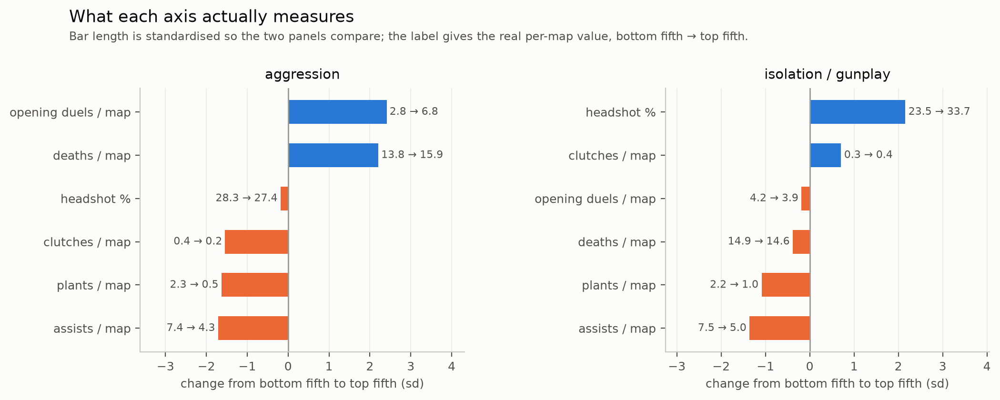
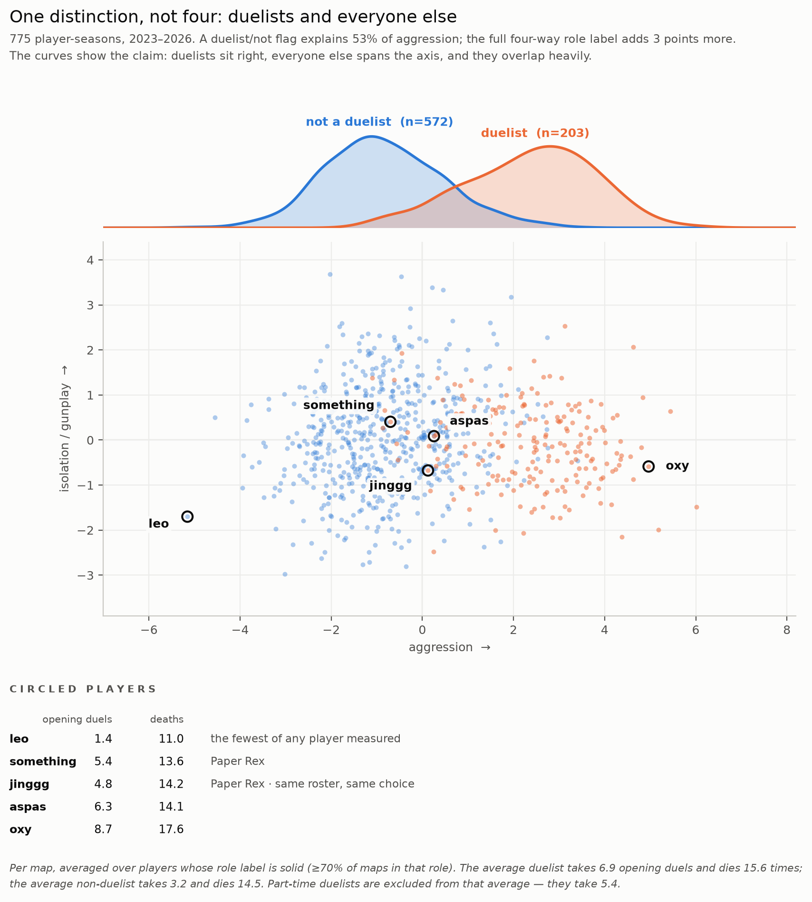
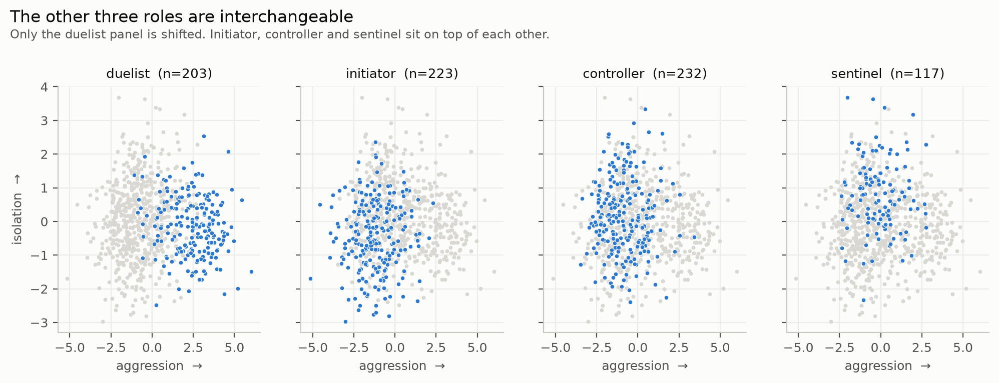
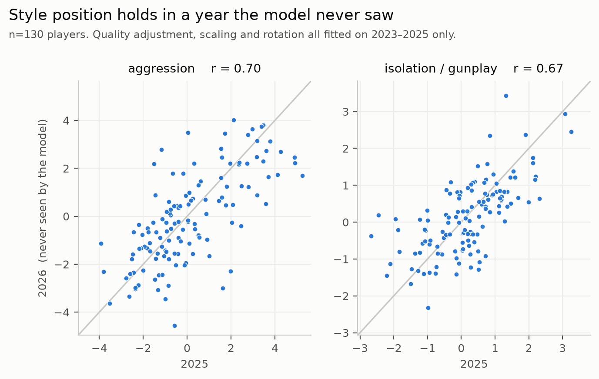
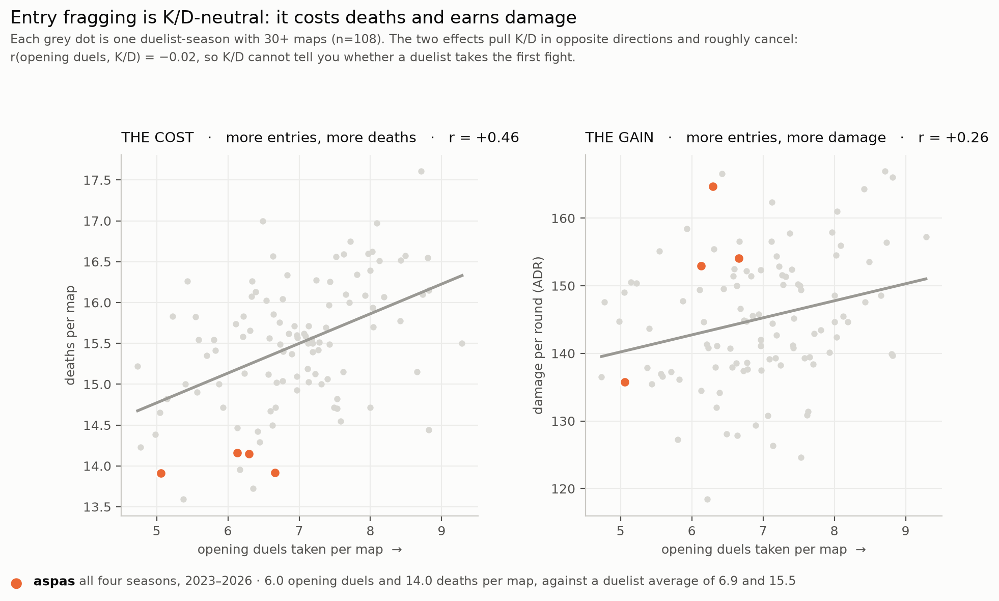

# Measuring playstyle in professional VALORANT

**Do pro players have distinguishable playstyles — and is playstyle anything more than
"how good they are" or "which agent they play"?**

775 player-seasons, 400 players, 1,532 matches. 2023–2026 franchised VCT, from public
vlr.gg match records. Snapshot 2026-09-19.

**[Explore the data interactively →](https://claude.ai/artifact/CBBTRTi4xj3xVPooeyhe88)**

---

## 1. One robust style dimension, and a second that is marginal

Eight behavioural measures reduce to **two** dimensions — but the two are not equally
established, and the report says so rather than rounding up.

Component retention was decided against a null: each feature column was shuffled
independently 500 times to destroy the relationships between features while preserving
each one's distribution, and only components beating the 95th percentile of that null
were kept.

```
        eigenvalue   null cutoff   margin    replicates
PC1          3.751         1.194   +2.557         0.994
PC2          1.189         1.128   +0.061         0.954
PC3          0.845         1.081   -0.236         0.828
```

**PC1 clears its null by a factor of three. PC2 clears it by 0.061** — and under a
defensible restriction (players with ≥70% of maps in one role) it *fails* by 0.073.
That isn't a sample-size effect: random subsets of the same size keep PC2 in 82% of
draws. PC2 is real — it replicates at 0.954 and holds out to 2026 — but it is a
marginal dimension, not a co-equal one.



**Aggression** (46.9%): opening duels taken, deaths, credits spent and an attack-side
skew, against assists, spike plants and clutches. Bottom fifth to top fifth: **2.8 → 6.8
opening duels** and **13.8 → 15.9 deaths** per map, while assists fall 7.4 → 4.3.

**Isolation / gunplay** (14.9%): **23.5% → 33.7% headshots**, assists 7.5 → 5.0, spike
plants 2.2 → 1.0. Uncorrelated with skill.

## 2. Riot's role taxonomy recovers exactly one of these, not four



Role explains 57% of the aggression axis — which sounds like the measure is just
re-deriving the role label. It isn't:

```
R² of aggression from the full 4-way role label      0.569
R² from a single duelist / not-duelist flag          0.536
R² from role among the 572 NON-duelists              0.101
```

**The four-way taxonomy adds 0.03 over a single binary flag.** Among the 416
player-seasons that never touched a duelist agent, **104 (25%) sit above the overall
aggression median**, and role explains 10% of where they land.



## 3. It generalises to a year the model never saw



The whole pipeline — quality adjustment, scaling, PCA rotation — was refitted on
**2023–2025 only**, then 2026 projected through it cold.

```
                        aggression   isolation
held-out 2025 -> 2026      0.700       0.665      n = 130
same pair, in-sample       0.709       0.696
```

**Hiding a year cost 0.009.** The criterion (within 0.15 of in-sample) was set before
looking.

---

## A case study: testing a popular claim

Fans have argued for years that **aspas** is a stat-padder — that his numbers come from
avoiding the round's first fight while teammates take it.



**First the general result, because it reframes the question.** Among duelist-seasons,
taking more opening duels costs deaths (r = +0.46) *and* earns damage (r = +0.26).
Those run in opposite directions through K/D — deaths are its denominator, damage
drives its numerator — and they cancel:

```
r(opening duels taken, K/D) = -0.02
```

**Entry fragging is K/D-neutral.** K/D cannot be padded by avoiding entries, and cannot
tell you whether a duelist is doing their job.

**Now the specific claim.** Four seasons, three teams, exclusively duelist agents
(Jett 57%, plus Raze, Neon and Waylay):

| | aspas | percentile among duelists |
|---|---|---|
| opening duels / map | 6.04 | **15th** |
| deaths / map | 14.03 | **3rd** |
| K/D | 1.28 | **97th** |
| ADR | 151.9 | 79th |

The premise holds — he takes the first fight less often than 85% of duelists, every
season measured. **The mechanism does not**, because a low entry rate does not raise
K/D.

*(Percentiles are against the 150 duelist-seasons whose label is solid — at least 70%
of maps on duelist agents. Against all 203 duelist-labelled seasons he is 32nd
percentile; the 53 excluded are part-time duelists averaging 5.4 opening duels, which
is not the comparison the claim intends.)*

**Paper Rex's duelists are a team pattern.** `something` and `jinggg` are the two least
aggressive duelists in the dataset, across three seasons each, on the same roster. The
duelist mean is 6.94 opening duels per map; they take 5.4 and 4.8.

**What this cannot show.** Baiting is a claim about intent and about teammates dying
while you hold back. This measures neither. A disciplined duelist playing late timings
and a genuine baiter are indistinguishable here.

---

## And one negative result

**Discrete archetypes do not exist here.** The original goal was to identify player
types.

*Do cluster boundaries land in the same place twice?* Mostly — splitting **by player**
and clustering each half gives 0.79 agreement at k=3, against 0.66 for a cloud built
with no groups.

*Is there empty space between the groups?* **No.** Separation scores 0.364, against
0.324 for that same structureless cloud. The groups touch everywhere.

Both can be true: a continuum with denser regions produces stable cuts without the
regions being separate. **17% of player-seasons sit close enough to a boundary that a
categorical label is arbitrary.** Positions on the axes are the primary output.

---

## Does any of it depend on the judgement calls?

Three specifications, each resting on a choice that was argued rather than derived:

```
                              n    components    R² role    positions vs STYLE
STYLE   (8 features)        775        2           .569          —
STRICT  (6 features)        775        2           .557      PC1 r = .978
CONC    (>=70% one role)    503        1           .730      PC1 r = 1.000
```

The same test on the season-length floor, swept from 5 maps to 30 — a six-fold change
in strictness, and 880 player-seasons down to 555:

```
floor        5      10      15      20      25      30
components   2       2       2       2       2       2
R² role   .577    .573    .566    .555    .549    .541
yoy PC1   .730    .704    .707    .715    .717    .707
```

Nothing moves by more than 0.036.

Dropping the two judgement-call features moves a player's position by r = 0.978 and
changes nothing structural. Held-out validation holds under both (0.700 / 0.689).

The concentration restriction is what surfaced PC2's fragility, and it also shows that
the "role explains little" result is **specification-dependent in magnitude** — among
role specialists role explains 0.730 rather than 0.569. The *structure* is unchanged: a
binary duelist flag still gets 0.704 of that 0.730.

---

## How it was built

Fifteen decisions, each with its diagnostic, its measured cost, and what would overturn
it, in [`decisions/`](decisions/). The ones that mattered most:

| | |
|---|---|
| **Style vs quality** | K/D is the yardstick, not ACS: ACS *accumulates* with fight volume so it is inflated by aggression itself, while a ratio cancels it. |
| **Confounder vs mediator** | Every quality measure is partly *caused* by playstyle, so controlling for all of them removes real style. K/D is the measure least likely to sit on that causal path; the choice is to under-control and state the direction of the remaining bias. |
| **Rare-event correction** | Players get ~8 clutch situations a season, so year-over-year correlation understates rare traits. Measured directly by splitting each season into random halves and corrected for. Changed two of nine feature decisions. |
| **Player, not team** | Stability was re-measured among players who *changed roster*. `clutch_att` fell from 0.36 to 0.14, revealing a team-assigned trait wearing a player-trait costume. |
| **No agent control** | Agent retention is 38% whether or not a player changes team, so agent is the player's. Role is held out as a *validation label* and never enters the model, so cross-role structure is shown rather than engineered. |
| **No invented thresholds** | Where a cutoff could not be derived, it was swept rather than defended. The 15-map season floor is arbitrary within a wide range — across floors from 5 to 30, a six-fold change in strictness, no headline number moves by more than 0.036 and the component count never changes. |

---

## Limitations

- **PC2 is marginal**, as stated above. It replicates and holds out, but clears its
  null by 0.061 and fails under one defensible restriction.
- **The name of the second axis is an interpretation.** "Lurking" — a player operating
  away from their team — fits five of seven predictions, including lower KAST, which is
  direct evidence of isolation. It fails the two tests that would separate lurking from
  a general low-utility, high-aim style. Settling it needs player positions and
  within-round timing; this dataset has neither.
- **One row averages several roles.** A player uses six agents in a median season, and
  22% of player-seasons spend under 60% of their maps in one role. For those, the
  season average blends jobs the player did separately — their year-over-year stability
  is 0.50 against 0.87 for specialists. The grain still can't be finer: a median
  player-agent-season is 4 maps, where the weakest features are unmeasurable.
- **`main_agent` is a weak label.** The modal agent covers 43% of a player's maps;
  the modal role covers 81%. Role-level claims are safe, agent-level ones are not.
- **2026 has no Champions event** — the held-out year is missing the top ~8% of
  competition. Stated, not corrected for.
- **Associational only.** No causal claim is made about style and results.

---

## Reproducing

```
src/data.py             scoping, grain, player identity
src/features.py         the eight behavioural measures
src/style.py            quality adjustment -> the style matrix
src/components.py       parallel analysis -> component retention
src/clusters.py         archetypes vs continuum
src/validate.py         held-out 2026
src/sensitivity.py      the three specifications
src/report_numbers.py   every figure quoted above, printed from the data
src/figures.py          the five figures
```

`stepNN_*.py` are the one-off diagnostics behind each decision, each still runnable.
